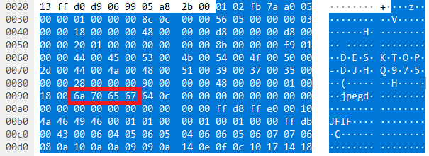

<p align="center"></p>

# BlackSpider

## 简介
java 实现“ [红蜘蛛网络教室](http://www.3000soft.net/) ”协议,兼容原版红蜘蛛。跨平台运行，同时支持Windows，Linux，Mac OS。

## 基本原理

1. 分析原版红蜘蛛通信协议
2. java接收通信数据包，解析数据，还原原始视频信号
3. 通过GUI技术显示在屏幕上

## 使用说明

`java -jar BlackSpider.jar`

on MacOS `java -XstartOnFirstThread -jar BlackSpider.jar`

native-image:exe文件，暂只支持window，双击运行即可

## 进度

- [x] 协议分析
- [x] 接收UDP广播
- [x] 图像数据还原
- [x] swing GUI
- [x] 至此完成基础功能
- [x] GraalVM本地化编译，脱离jre
- [ ] 代码重构
- [ ] 编写教师端:eyes:

### 构建

#### fat-jar

```bash
mvn clean
mvn -B package --file pom.xml -Dmaven.test.skip=true -Pwindows
mvn clean
mvn -B package --file pom.xml -Dmaven.test.skip=true -Plinux
mvn clean
mvn -B package --file pom.xml -Dmaven.test.skip=true -Pmac
```

#### native-image

环境参考[官方文档](https://www.graalvm.org/reference-manual/native-image/)

windows下需要安装[Visual Studio 2019](https://visualstudio.microsoft.com/zh-hans/vs/) ，[GraalVM 21.0.0-dev](https://github.com/graalvm/graalvm-ce-dev-builds/releases/) (不支持release版，暂且使用开发版),

```
mvn -B package --file pom.xml -Dmaven.test.skip=true -Pwindows-native
```

## 细节

#### 协议分析
抓包工具[Wireshark](https://www.wireshark.org/)


从抓包信息可以看出，红蜘蛛使用udp通信，由教师机向局域网广播信号，端口号为1689.

学生机可绑定`0.0.0.0:1689`,即可接收所有网卡发来，指向1689端口的udp包

数据包包含包头以及图像数据，部分主要包头数据格式如下表，包头大小为128字节。数据包如果大于1482字节，将会分包发送。


接下来是图像数据，红蜘蛛有四种清晰度，从高到低采用的压缩格式分别是`lzo&zlib`，`lzo`，`jpeg`，`jpeg有损`。目前本项目实现了后三种的解码，zlib的解压方法仅在test中有所体现。

包头大小为128字节，后续紧跟图像数据，`jpeg`模式下，包头如下，红框展示了jpeg文件头。



#### jpeg解码

在1.0版本，采用jdk自带的解码工具`ImageIO`，速度极慢。2.0开始采用[libjpeg-turbo](https://libjpeg-turbo.org/) ,该软件采用SIMD加速，充分利用现代cpu指令集高速解码。

#### lzo解压

lzo是一种高速压缩算法，红蜘蛛用它对图像进行无损压缩。

jdk没有相关库，maven找一个

```java
<!-- https://mvnrepository.com/artifact/org.anarres.lzo/lzo-core -->
<dependency>
    <groupId>org.anarres.lzo</groupId>
    <artifactId>lzo-core</artifactId>
    <version>1.0.6</version>
</dependency>
```

#### GUI呈现

在1.0版本，使用swing显示图像，正常使用速度可接受，但图像缩放速度太慢，且暂时不被GraalVM支持。

2.0换用[swt](https://www.eclipse.org/swt/) + [jogl](https://jogamp.org/jogl/www/)

swt提供窗口支持

jogl通过jni绑定了OpenGL，OpenGL是用于渲染2D、3D矢量图形的跨语言、跨平台的应用程序编程接口，他能调用显卡进行图像渲染，效率极高。

#### 本地化编译

[GraalVM](https://www.graalvm.org/) 提供了一种名为native-image的工具，他先通过静态分析找到Java程序用到的所有类，方法和字段以及一个非常小的SVM运行时，然后把这一堆东西通过AOT编译，生成一个可执行文件。它的功能远不止此。

这样java程序就能脱离jre独立运行，启动速度加快，内存占用减少。

但这抹去了java所有的动态特性，对于反射，动态代理等。这些类只有在java程序真正运行起来才会被创建，难以通过静态分析获得。

所以native-image提供了native-image-agent工具，记录程序运行时加载的类，用以辅助AOT编译。

